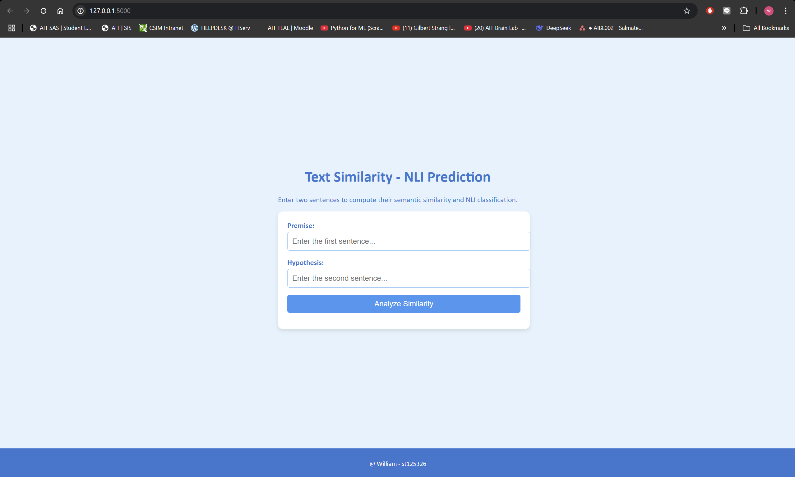

# A4: Do-You-AGREE
Enjoy reading my A4 Assignment for NLP class.

## Author Info
Name: WIN MYINT@HTET WAI YAN HTUT (WILLIAM)
Student ID: st125326

## Task 1: Training BERT from Scratch (2 points)
1. The dataset used for training is the 'bookcorpus' dataset, which is sourced from the Hugging Face Datasets library.
- This dataset is a collection of books from the BookCorpus project.
- The dataset is publicly available and can be accessed via the Hugging Face Datasets library.
- Source: Hugging Face Datasets - https://huggingface.co/datasets/bookcorpus
- Reference: Zhu, Y., Kiros, R., Zemel, R., Salakhutdinov, R., Torralba, A., Urtasun, R., & Fidler, S. (2015).
2. Trained model weights saved for further use using pickle.
- n_layers = 6    # number of Encoder of Encoder Layer
- n_heads  = 8    # number of heads in Multi-Head Attention
- d_model  = 768  # Embedding Size
- vocab size = 60,305

## Task 2: Sentence Embedding with Sentence BERT (3 points)
- I use MNLI dataset only for training.


## Task 3: Evaluation and Analysis (1 point)
1. Provide the performance metrics based on the SNLI or MNLI datasets for the Natural Language Inference (NLI) task.
### Performance Metrics

| **Model Type**       | **MNLI Performance**                                                                 |
|-----------------------|-------------------------------------------------------------------------------------|
| **Our Model**         | Accuracy: 0.3320, Precision: 0.1102, Recall: 0.3320, F1-Score: 0.1655              |

2. Discuss any limitations or challenges encountered during the implementation and propose potential improvements or modifications.
## Limitations/Challenges:
- The model achieves relatively low performance on the MNLI dataset, with an accuracy of 0.3320 and an F1-score of 0.1655.
- This suggests that the model struggles to correctly classify the relationships (entailment, neutral, contradiction) between sentence pairs.
- Datasize is limited and reduced due to the capacity of GPU memory. Using more Datasize and better GPU, can bring better results.

## Potential Improvement:
- Fine-tune the model on a larger and more diverse dataset to improve its ability to generalize across different sentence pairs.
- Experiment with different hyperparameters (e.g., learning rate, batch size, number of epochs) to optimize model performance.
- Evaluate the model on the SNLI dataset to compare its performance across different NLI datasets.

## Task 4: Web App (1 point)


How to run the web app
1. Pull the github repository
2. Run
```sh
python app/app.py
```
3. Access the app using http://127.0.0.1:5000

## How to use website
1. Open a web browser and navigate to http://127.0.0.1:5000.
2. Enter the 1st sentence in "Premise" field.
3. Enter the 2nd sentence in "Hypothesis" field.
4. Click "Analyze Similarity" button,
5. The App displays the  NLI Classification that describe the 2 sentences.
 - contradiction (The hypothesis is false given the premise.)
 - neutral (The hypothesis is neither true nor false given the premise; there is no clear relationship.)
 - entailment (The hypothesis is true given the premise.)

## Screenshot of my web app

